

# 🍽️ Comparative Consumer Behaviour Analytics for Online Food Delivery Platforms

### A Machine Learning-Based Study Using 462 Real-World Survey Responses

### 📊 Consumer Analytics • Machine Learning • Research Publication

**B.Tech Major Project (Data Science)**
**IILM University, Greater Noida**

---

## 📖 Project Overview

The rapid growth of online food delivery platforms has transformed consumer purchasing behavior. Understanding the factors that influence food ordering habits and platform preferences has become increasingly important for both businesses and researchers.

This project presents a comprehensive **Consumer Behaviour Analytics Framework** developed using **462 self-collected survey responses** from food delivery users. The study combines exploratory data analysis, predictive modeling, and comparative machine learning techniques to identify patterns in consumer decision-making and app preference.

Unlike many studies that rely on publicly available datasets, this research is built entirely on real-world survey data collected specifically for this project, making the findings more practical and representative of actual user behavior.

### Key Areas of Analysis

* Consumer Behaviour Analytics
* Food Delivery Platform Preferences
* Exploratory Data Analysis (EDA)
* Comparative Machine Learning Models
* Feature Importance Analysis
* Predictive Modeling
* Research Contribution

---

## 🎯 Project Objectives

✅ Analyze consumer ordering behavior using real-world survey data

✅ Study food delivery application preferences

✅ Identify major factors influencing app selection

✅ Perform exploratory data analysis

✅ Compare machine learning algorithms

✅ Generate actionable business insights

✅ Contribute to academic research in consumer analytics

---

## 📊 Dataset Information

| Attribute    | Description                |
| ------------ | -------------------------- |
| Source       | Google Forms Survey        |
| Responses    | 462                        |
| Dataset Type | Consumer Behaviour Dataset |
| Feature Type | Categorical                |
| Domain       | Food Delivery Analytics    |

### Features Included

* 👥 Age Group
* 📅 Ordering Frequency
* 💰 Spending Range
* 📱 Preferred Delivery Application
* ⏰ Time of Ordering
* 🍔 Fast Food Preference
* ☕ Café Preference
* 🍽 Dining Preference
* 💳 Order Value
* 📦 Delivery App Usage Behaviour

---

# 🔍 Exploratory Data Analysis

Understanding consumer behaviour begins with understanding the data. Various visualization techniques were used to identify trends, preferences, and behavioral patterns.

---

## 👥 Age Distribution

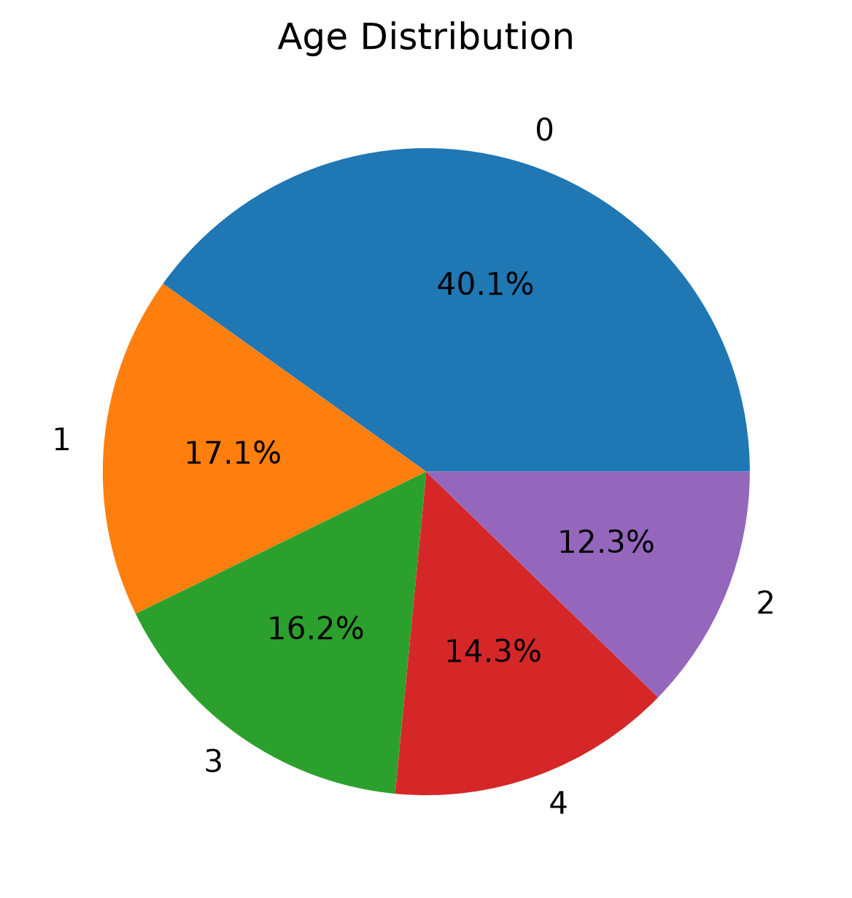

### Insights

* A dominant age category accounts for approximately 40% of the total responses.
* Younger consumers represent the most active food delivery users.
* The dataset reflects strong participation from digitally engaged users.

---

## 📊 Age vs Ordering Frequency

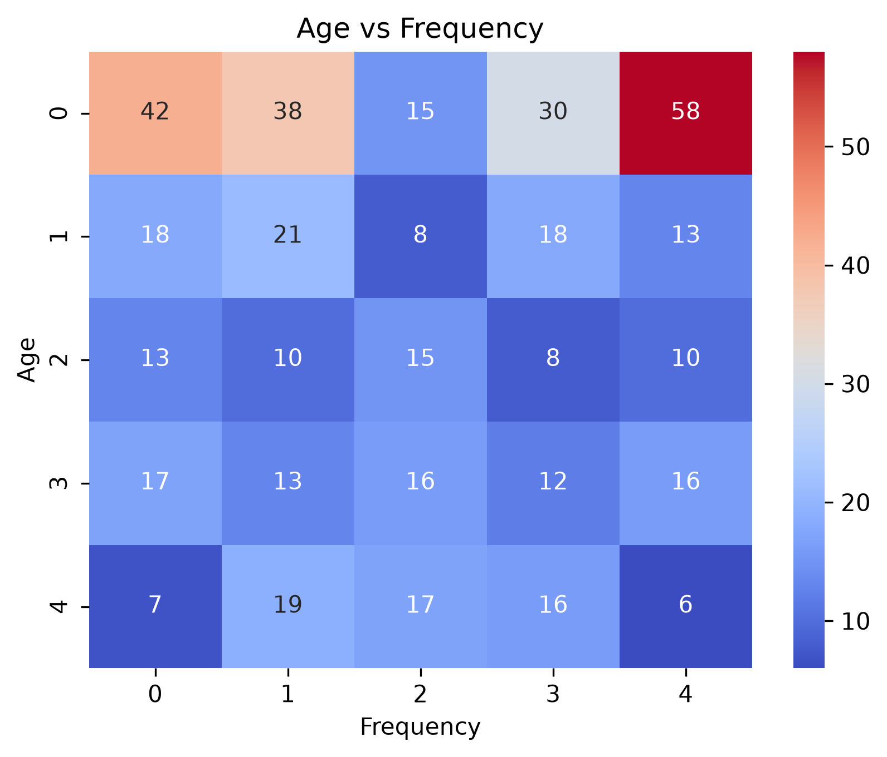

### Insights

* Ordering frequency varies significantly across age groups.
* Certain age categories demonstrate stronger engagement with delivery platforms.
* The heatmap highlights relationships between age and consumption habits.

---

## 📱 Delivery App Usage Distribution

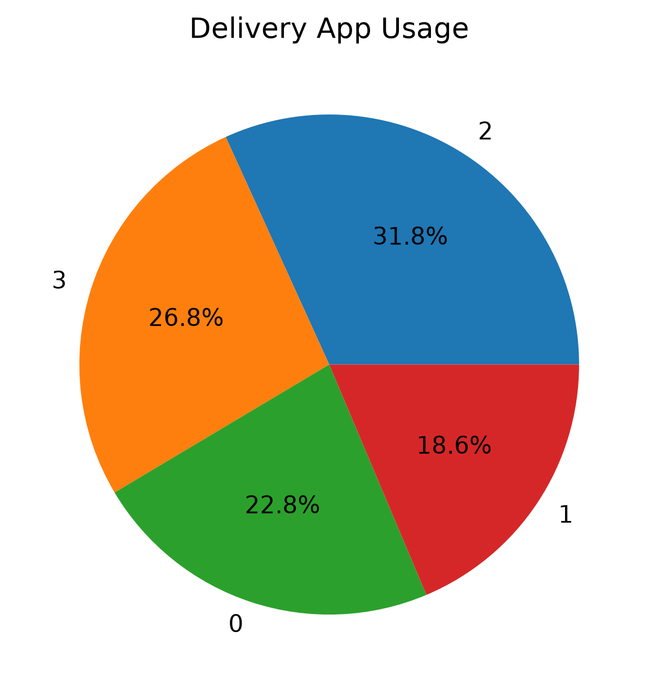

### Insights

* User preferences are distributed across multiple delivery applications.
* Competition among platforms remains highly competitive.
* Consumer loyalty varies between applications.

---

## 🍽 Food Ordering Frequency

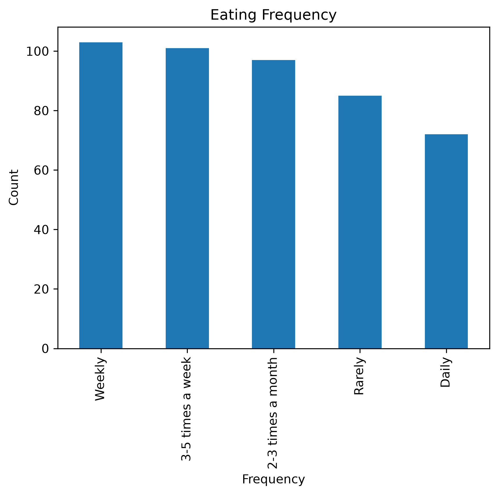

### Insights

* Weekly food ordering is the most common behavior.
* Daily ordering represents the smallest consumer segment.
* Most respondents exhibit moderate platform usage patterns.

---

## ⏰ Time of Ordering Analysis

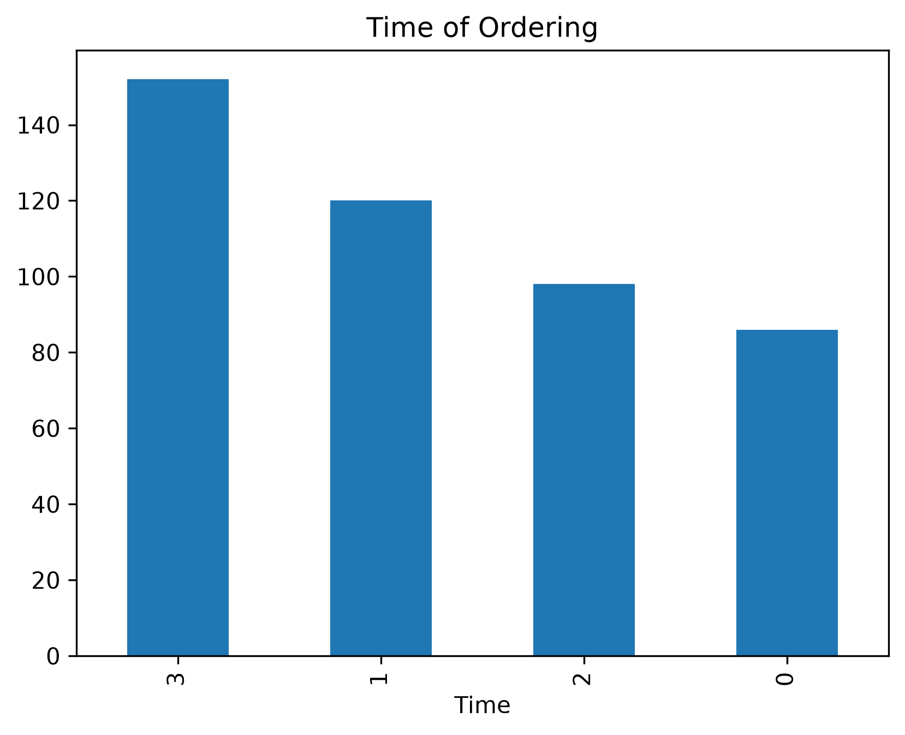

### Insights

* Consumer activity peaks during specific ordering periods.
* Ordering time plays an important role in platform preference.
* User engagement changes significantly across time categories.

---

## 🍔 Popular Fast Food Chains

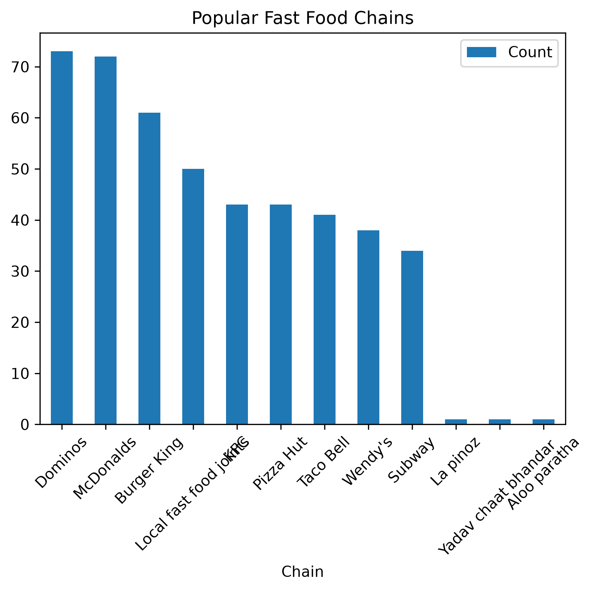

### Most Preferred Brands

🥇 Domino's

🥈 McDonald's

🥉 Burger King

🏅 KFC

🏅 Pizza Hut

### Observation

Brand availability strongly influences food delivery platform preference and purchasing decisions.

---

# 🤖 Machine Learning Implementation

The project evaluates multiple machine learning algorithms to predict consumer preferences and compare classification performance.

### Models Evaluated

| Model               | Accuracy (%) |
| ------------------- | ------------ |
| Random Forest       | 44.5         |
| Logistic Regression | 39.1         |
| XGBoost             | 36.8         |
| Extra Trees         | 36.8         |
| Decision Tree       | 35.7         |
| Gradient Boosting   | 35.7         |

---

## 📈 Comparative Model Performance

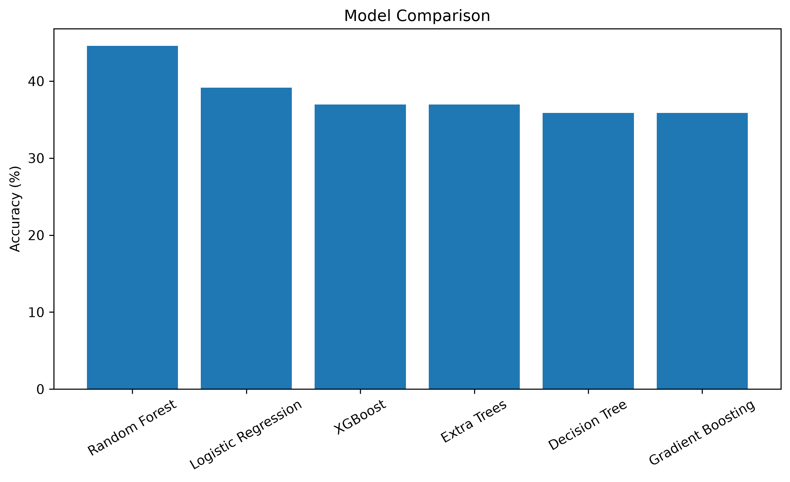

### 🏆 Best Performing Model

**Random Forest Classifier**

Reasons for superior performance:

* Ensemble Learning
* Better Generalization
* Reduced Overfitting
* Strong Feature Ranking Capability
* Improved Predictive Stability

---

# 🔥 Feature Importance Analysis

Understanding which factors influence consumer choices is one of the primary objectives of this study.

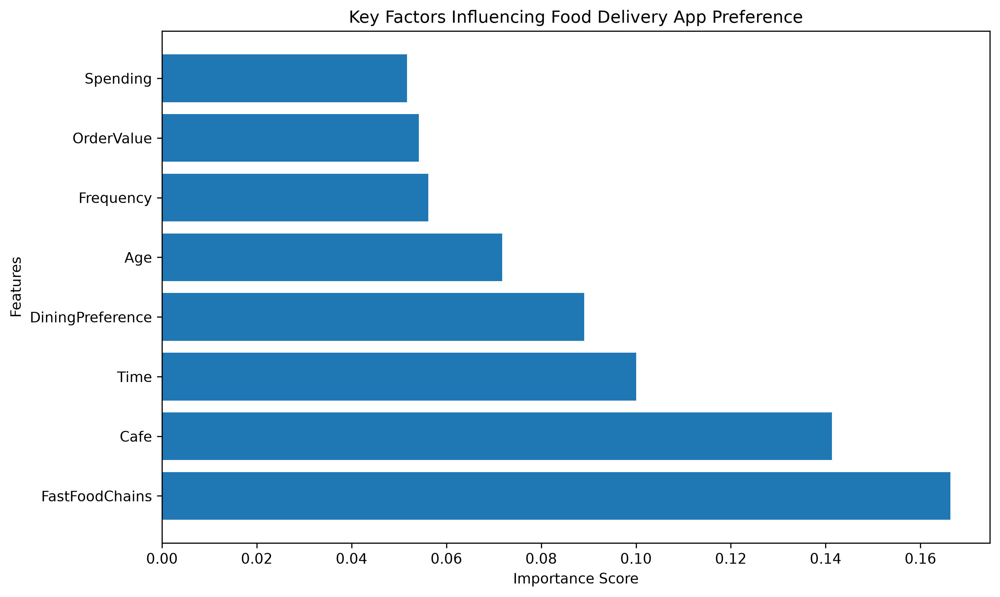

### Key Influencing Factors

| Rank | Feature            |
| ---- | ------------------ |
| 1    | Fast Food Chains   |
| 2    | Café Preference    |
| 3    | Time of Ordering   |
| 4    | Dining Preference  |
| 5    | Age                |
| 6    | Ordering Frequency |
| 7    | Order Value        |
| 8    | Spending Range     |

---

## 📊 Random Forest Feature Importance

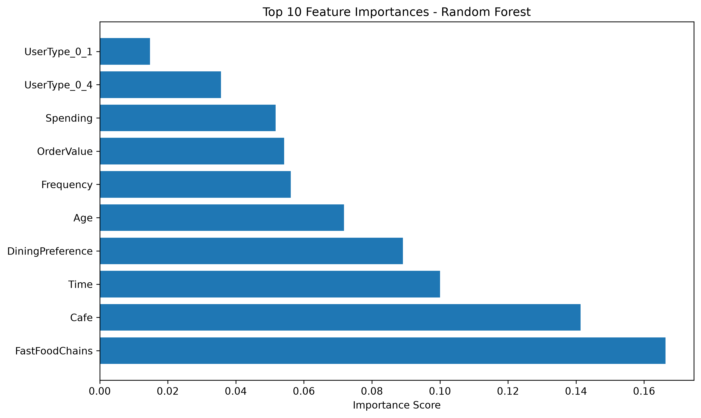

### Major Finding

Food-related preferences have a stronger impact on app selection than demographic variables.

Consumer decisions are influenced more by:

* Preferred restaurant brands
* Café availability
* Ordering habits

than by age or spending characteristics.

---

## 🥧 Top Factors Affecting App Choice

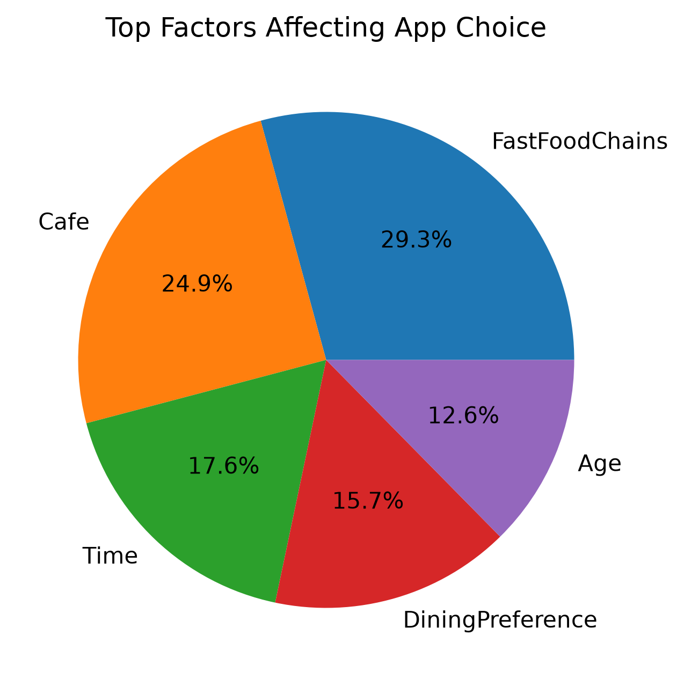

This analysis reinforces the dominance of food preference variables in determining platform selection.

---

# 📉 Random Forest Confusion Matrix

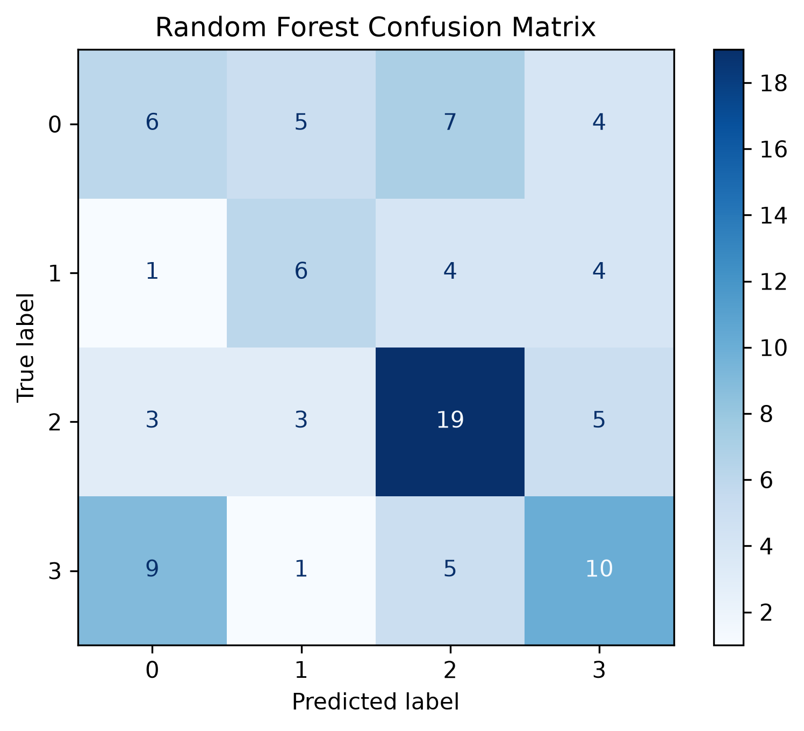

### Interpretation

The confusion matrix provides a detailed view of classification performance across all classes and highlights strengths and weaknesses of the best-performing model.

---

# 📊 Evaluation Metrics

The models were evaluated using:

* Accuracy
* Precision
* Recall
* F1-Score
* Confusion Matrix
* Feature Importance Analysis

---

# 📄 Research Contribution

This project has contributed to academic research in the field of consumer behaviour analytics and machine learning.

### Published Research Paper

**Consumer Behaviour Analytics Using Food Delivery Platforms**

🔗 https://janolijournals.com/index.php/jijcse/article/view/326

### Research Focus

* Consumer Behaviour Analysis
* Food Delivery Platform Preferences
* Data Visualization
* Decision Tree Classification
* Predictive Consumer Analytics

### Current Extension

The ongoing extension of this work focuses on:

* Comparative Machine Learning Analysis
* Ensemble Learning Models
* Advanced Feature Evaluation
* Consumer Behaviour Prediction Enhancement

---

# 🚀 Future Scope

* Larger and more diverse datasets
* Real-time consumer data integration
* Deep Learning approaches
* Recommendation Systems
* Customer Segmentation
* Explainable AI (SHAP & LIME)
* Demand Forecasting
* Personalized Consumer Analytics

---

# 🛠️ Technology Stack

| Category                | Tools                 |
| ----------------------- | --------------------- |
| Programming Language    | Python                |
| Data Analysis           | Pandas, NumPy         |
| Visualization           | Matplotlib, Seaborn   |
| Machine Learning        | Scikit-Learn, XGBoost |
| Development Environment | Jupyter Notebook      |

---

# 👥 Team Members

* Hifza Amir
* Keshav Bangia
* Himansh
* Janvi
* Akshat Arora

---

# 👨‍🏫 Project Supervisor

**Dr. Narendra Kumar**

Department of Computer Science & Engineering

IILM University, Greater Noida

---

# 🎯 Key Takeaways

* Real-world survey data provides meaningful consumer insights.
* Food preferences influence platform choice more than demographics.
* Ensemble models outperform traditional single classifiers.
* Consumer behaviour is highly multifactorial and dynamic.
* Data-driven analytics can support strategic decision-making in the food delivery industry.

---

## 📚 Research • 📊 Analytics • 🤖 Machine Learning

### Consumer Behaviour Analytics for Food Delivery Platforms

⭐ Developed as a Major Project in Data Science

